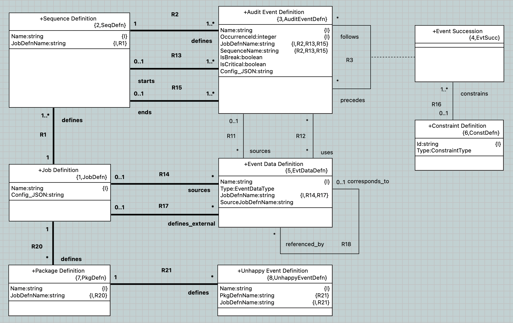

= plus2json

This repository holds engineering artifacts for a PLUS language processor which
parses PLUS (based on PlantUML) and produces Protocol Verifier job definitions
formatted as JSON.

== Build

plus2json requires some files to be generated (Antlr-based parser and schema
gen). To generate the necessary files run:

  python bundle.py dev

NOTE: For this build to work, the `WORKSPACE` variable must be set to an
Eclipse workspace containing the `plus` BridgePoint project. The `antlr4-tools`
python package must also be installed.

== Run

To run plus2json in the repository, run:

  python -m plus2json

To print usage and help, run:

  python -m plus2json -h

== Test

To run unit tests, run:

  python -m unittest

== Usage

----
usage: python plus2json.pyz <command> [-v] [-h] [--debug] [--pretty-print] [-o dir]  [filenames ...]

plus2json is a utility for processing PLUS job definitions and producing JSON ouptut for congifuring and testing the protocol verifier.

Commands:
  --job                 Ouput PLUS job definition
  --play                Generate runtime event data

Global Options:
  -v, --version         show program's version number and exit
  -h, --help            Show this help message and exit
  --debug               Enable debug logging
  -p, --pretty-print    Print human readable debug output
  -o dir, --outdir dir  Path to output directory
  filenames             Input .puml files

Play Options:
  --integer-ids         Use deterministic integer IDs

Examples:
    # load Tutorial_1.puml and print a human readable version of the definition to the console
    python plus2json.pyz job Tutorial_1.puml --pretty-print

    # convert Tutorial_1.puml into JSON and output to the console
    python plus2json.pyz job Tutorial_1.puml

    # convert all .puml files in the 'puml' directory and write each to a JSON file in 'job_definitions'
    python plus2json.pyz job -o job_definitions puml/*.puml
    # load Tutorial_1.puml and print a human readable stream of events to the console
    python plus2json.pyz play Tutorial_1.puml --pretty-print

    # load Tutorial_1.puml and print a JSON stream of events to the console
    python plus2json.pyz play Tutorial_1.puml

    # load all .puml files in the 'puml' directory and write steam of events for each to a JSON file in 'job_definitions'
    python plus2json.pyz play -o job_definitions puml/*.puml
----

=== Package for release

To package the `plus2json.pyz` bundle, run:

  python bundle.py

=== Data Model

This is the structure of the job definition. PLUS `.puml` files are parsed, and
instances of these classes are created and linked.

