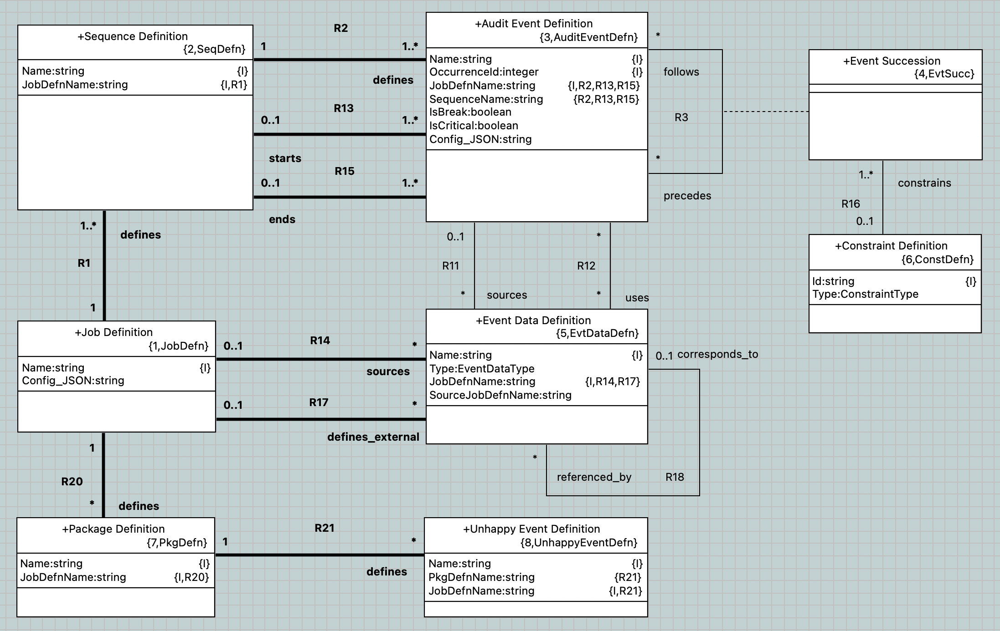

= `json2plus` Analysis and Sizing

xtUML Project Analysis Note

== 1 Abstract

This document analyses a conversion from Job Definition JSON into the PLUS
Plant UML textual syntax.

== 2 Introduction and Background

Job definition JSON is usually derived from PLUS.  The job definition JSON
is then supplied to the Protocol Verifier to populate the specification
classes against which runtime audit event streams will be verified.

However, another source of job definition JSON has been developed.
Analysis is performed on a stream of runtime audit events retrieved from
an undocumented system.  The analysis can substantially infer job
definitions (in data instance format) that describe the observed stream of
audit events.  It would be nice to produce the PLUS job definitions from
the instance data.  These inferred job definitions may serve as a good
starting point for a more complete prescriptive job definition.

`plus2json` has a model of the job definition.  It also has tooling for
converting textual job definitions into data model instances.  This note
explores going the other way, producing textual PLUS job definitions from
instance populations provided as input JSON.

== 3 Requirements

. Determine feasibility of `json2plus`.
. Provide analysis of approaches to implementing `json2plus`.
. Outline work required.
. Estimate the effort required.

== 4 Analysis

=== 4.1 Feasibility

==== 4.1.1 PLUS

PLUS represents job definitions in syntax resembling a programming
langauge.  The metaphor starts with 'job' being similar to program.
'sequence' is like a subroutine.  The fundamental instruction is an
'audit event'.  Sequencing of audit events is largely linear with one
event following another on the next line.

Branching and looping are constructed using instructions such as 'if',
'then', 'else', 'switch', 'case', 'fork', 'split', 'repeat', 'while', etc.
`plus2json` parses PLUS and populates a job definition data model.

==== 4.1.2 Job Definition JSON

Job definition JSON is governed by a data model formalised as a class
diagram in xtUML and enforced with a JSON schema.  Ordering is captured in
relationships between data elements.  The data model is relational and can
be understood as a directed graph.

===== 4.1.2.1 `plus2json` Data Model

`plus2json` is built around an xtUML model of Job Definition.  For
`plus2sjon`, PLUS job definitions are parsed and populated into this
model.  JSON is then serialised from the model.

For `json2plus`, the JSON would be loaded into this model.  The model
would then be queried, and textual PLUS would be produced.

This seems the most natual and expedient approach.

===== 4.1.2.2 Sequence Verification Model

AEOrdering and Sequence Verification domains also operate around a model
of Job Definition.  These models already possess loaders to populate them
from JSON.  Queries could be written to navigate the model and produce
textual PLUS.

This is a feasible approach but is not as natural as augmenting
`plus2json` which already focuses on textual PLUS as a concern.

== 5 Work Required

. Parse the job definition JSON using json.load.
. Populate the model of 'definition' from the input JSON.
  .. descend into Events
     ... loop through and create each Audit Event Definition
         .... create Event Data Definitions linking the source Audit Event Definition
     ... loop through again and create and link Event Successions
         .... create and link Constraint Definitions
  .. descend into UnhappyEvents
     ... loop through and create each Unhappy Event Definition
. Populate the model of 'population'?
. render_job_defn
  .. render_sequence(aed) : p
     ... render_fragment(aed) : p, naed
         .... render_fork(aed) : p, naed
              ..... render_tine(aed) : p, naed
         .... render_loop(aed) : p, naed
              ..... render_tine
         .... render_audit_event(aed) : p, naeds
              ..... render_tine
   .. render_package
      ... render_unhappy_event
. Detect structures.
  .. Detect forks.
    ... Find multiple Event Succession instances following with the same constraint.
    ... AND is 'fork'.
    ... XOR is 'switch'.
    ... OR ('split') is not supported.
    ... 'if','then','else' is redundant to 'switch' and will not be produced.
  .. Detect merges.
    ... Find multiple Event Succession instances preceding with me as a succession.
  .. Detect loops.
    ... start of loop
        .... Find a precession event that does not have me as a succession.
    ... end of loop
        .... Find a succesion event that does not have me as a precession.
    ... Break
        .... IsBreak is true

== 6 Acceptance Test

. Translate regression Puml job definitions into JSON.
. Translate this JSON back into Puml job definitions.
. Diff them.
. Run the Protocol Verifier with them.

== 7 Document References

. [[dr-1]] https://github.com/xtuml/plus2json/issues/57[57 - Consider `json2plus`]

---

This work is licensed under the Creative Commons CC0 License

---
