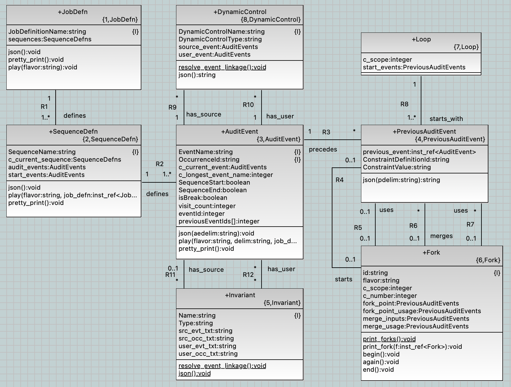

= PLUS-to-JSON Design

xtUML Project Design Note

== 1 Abstract

This note documents the design of the 'plus2json' utility.

== 2 Introduction and Background

A language named 'PLUS' (roughly PlantUML Sequences) is defined using UML
Activity Diagram syntax.  This language supplies a syntax with which
"protocol jobs" may be expressed.  Protocol jobs prescribe the sequencing
of audit events produced during the execution of some system or device
adhering to an explicit protocol.  PLUS job definitions are used to
configure a __Protocol Verifier__ enabling it to monitor run-time
performance of a device and enforce adherence to the prescribed protocol
as expressed in the PLUS job definitions.

'plus2json' is a utility which converts PLUS job definitions into a JSON
format consumable by a Protocol Verifier.  'plus2json' performs other
tasks as documented in this design note.

== 3 Requirements

=== 3.1 PLUS Language Definition (Grammar)

. 'plus2json' shall define the legal syntax of the PLUS language.
. The PLUS grammar shall be free of translation rules (pure grammar
  production rules only).

=== 3.2 PLUS Parser

. 'plus2json' shall implement a parser which performs lexical analysis and
  parses input PLUS job definitions enforcing correct syntax.
. The 'plus2json' parser shall report syntax errors clearly enough that a
  user receives sufficient feedback to repair erroneous PLUS job definitions.

=== 3.3 PLUS Tree Walker

. 'plus2json' shall employ a mechanism to convert the textual PLUS job
  definition into an abstract data model derived from a Shlaer-Mellor class
  diagram.
. 'plus2json' shall employ a method of conversion (from textual PLUS into
  data model instances) that minimises coupling between the PLUS syntax and
  the abstract data model.

=== 3.4 PLUS Job Definition Data Model

. At the core of 'plus2json' shall be a data structure derived from an
  abstract data model of the PLUS job definition domain.
. The 'plus2json' data model shall abstract the key concepts of the PLUS
  job definition domain including definition elements such a 'job',
  'sequence', 'audit event' and 'invariant'.
. The 'plus2json' data model shall (also) abstract run-time data elements
  conforming to the definition elements.

=== 3.5 PLUS Job Definition JSON

. 'plus2json' shall convert input PLUS job definitions expressed as PLUS
  into JSON compliant with a format consumable by a Protocol Verifier.
. The format of the output JSON is governed by a JSON schema which shall
  be obtained from the Protocol Verifier.

TODO:  Consider publishing the JSON schema here.
       It would be better to talk about the schema more than PV application.

=== 3.6 Protocol Verifier Configuration

. 'plus2json' shall assist in the production of configuration files (in
  JSON format) for the Protocol Verifier.

=== 3.7 PLUS Job Definition Play

. 'plus2json' shall interpret PLUS job definitions and produce run-time
  audit event instance streams in JSON format compliant with the schema
  prescribed by the Protocol Verifier.
. 'plus2json' shall produce legal audit event instance streams in
  conformance with given job definitions.
. 'plus2json' shall produce multiple legal audit event instance streams to
  provide coverage of all possible paths (excluding variance in repetition)
  through a legal job definition.

== 4 Analysis

The primary analysis work around 'plus2json' was accomplished in the
development of the <<dr-4,PLUS Tutorial>>.

== 5 Design

This section outlines design choices made during the development of
'plus2json'.  The section is ordered congruently to the requirements section.

=== 5.1 PLUS Language Definition (Grammar)

The grammar for 'plus2json' is defined in `plus2json.g4`.  The production
rules for the parser are supplied at the top.  The lexical tokens for the
keywords and punctuation are supplied at the bottom.  The PLUS grammar is
expressed in Extended Backus-Naur Form.

=== 5.2 PLUS Parser

The PLUS parser is automatically generated from the antlr4 grammar.  The
command used to produce the parser is as follows:

`antlr4 -Dlanguage=Python3 plus2json.g4`

TODO:  automate this in setup.py

TODO:  perhaps use the antlr4.jar directly

=== 5.3 PLUS Tree Walker

A listener pattern is used to override 'enter' and 'exit' methods on a
tree-walking pass of the parser.  These methods have access to the textual
tokens and identifiers being parsed from the PLUS job definition.  The
population of the PLUS job definition data model is realised by invoking
model element constructors during the walk.

The listener methods are packaged in `plus2json_run.py`.

=== 5.4 PLUS Job Definition Data Model

The 'plus2json' data model is a set of Python classes (indirectly) derived
from a Shlaer-Mellor class diagram.  Both class-based and instance-based
attributes are employed as appropriate.  Both class-based and
instance-based operations are defined on the classes.  Association links
are realised using reference attributes.

The data structures and operations at the core of 'plus2json' are defined
in `plus_job_defn.py`.

==== 5.4.1 instance populations

Instances of classes are stored in a Python list in a class-based attribute
called 'instances'.  During the tree-walk, constructors are invoked on the
classes.  A reference to the class is stored in the 'instances' collection.

At present, these instance collections are accessed directly by the
application.  In most cases a navigation should be used.

==== 5.4.2 relationship navigation

Some relationships from the data model are realised with references named
after the relationship (including role phrase).  This is not implemented
in a consistent manner.

TODO:  Consider importing pyxtuml to get the relationship navigation idiom.

==== 5.4.3 previous event

An instance of PreviousAuditEvent is created for each reference to a
previous audit event from an audit event.  This implies that multiple
previous events refer to the same audit event.

==== 5.4.4 current event

The population of the data model relies on remembering the current audit event
while parsing (walking) and processing the next audit event.  This implies that
much of the processing depends upon the sequential parsing of the textual
PLUS.

==== 5.4.5 occurrence assignment

Occurrence IDs are not required in the source PLUS.  When not explicitly
supplied, 'plus2json' manufactures the occurrence ID for the audit event.
When explicitly supplied, checking is done for erroneous duplicates.

==== 5.4.6 forward reference resolution

The specification of dynamic controls and invariants in the PLUS source
often makes forward reference to a user audit event.  'plus2json' employs a
single pass parsing and population of the data model.  This implies that
a reference will be made to an audit event that has not yet been created.
This is resolved with a second pass resolution of the dynamic controls and
invariants linking to audit events by name and occurrence.

==== 5.4.7 fork/merge/loop usage cache

A relatively awkward and fragile mechanism in 'plus2json' uses an
accumulation of previous events at the end of each "tine" on a fork.  When
the merge event is finally detected, these accumulated previous events are
attached.

A similar caching approach is used to carry forward a previous event
representing the start of the fork.  This allows the fork point to be tied
to the beginning of each tine in the fork.

This approach is also used to cache the beginning of a loop.

The fragility of this approach may be the root of the difficulty with
"adjacent features".  At present, intermediate events between features
makes life easier for 'plus2json'.

==== 5.4.8 id factories

The 'plus2json' data model employs classes for the definition elements.
However, it does not presently employ classes for run-time elements.
Run-time instances are either members of collections and stored as
attributes or are simply transient data.

Id factories are used to produce much of these collection and transient
instances.

==== 5.4.9 xtUML Data Model

.PLUS Job Definition Data Model

=== 5.5 PLUS Job Definition JSON

The primary requirement and use case of 'plus2json' is to convert PLUS job
definition files into the JSON format consumable by the Protocol Verifier.
This behaviour is defined in `plus_job_defn_json.py`.  The JSON production
is accomplished by simple string arithmetic.  It has been a consideration
to use Python objects, instead.  However, the benefits have not so
far outweighed the direct approach chosen.

TODO:  Disagreement noted.  Let us look more deeply.  I would like it to be cleaner than it is.

==== 5.5.1 Pretty Print

A "pretty print" option is supported together with job definition
production.  This pretty print is also supported with the interpretive
'--play' option.  This option outputs a textual summary of the output
which is more human readable than the equivalent JSON.  This is useful to
inspect the output of 'plus2json' and determine correct behaviour of the
utility as well as having an alternate form to visualise the job
definition (and the --play audit event instance sequence).

The pretty print output is compact, textual and intended to be easy to
understand.

=== 5.6 Protocol Verifier Configuration

Configuring the Protocol Verifier has some complexity.  'plus2json'
attempts to automate and make configuration easier.  However, the
configuration of the Protocol Verifier has recently gotten simpler.  If
it continues to simplify, then this capability may be removed.

There is a push to segregate global Protocol Verifier configuration from
job definition specific configuration.  The direction taken may be to
encode these job definition specific parameters within the job definition
file itself.  This may involve defining PLUS syntax to carry these
configuration values.

=== 5.7 PLUS Job Definition Play

In an almost unexpected way, it was discovered that the populated
'plus2json' data model of job definitions could be interpreted.  All of
the information necessary to produce run-time audit event instance
streams is (necessarily) contained within this data.  It proved to be
simple to "play out" legal audit event instance streams for simple job
definitions.

It remains to be seen the whether production of audit event instance
streams from more complex jobs remains tractable.  It is the present
intention to attempt to produce all possible legal audit event streams
(excluding variations in repetition).  This is desirable for test coverage
purposes.

Some of the design choices for this '--play' capability are described
in the following sections.

=== 5.7.1 Linking Previous Event

In play mode, audit event instances get Ids from an ID factory which uses
a UUID to produce JSON or a simple integer string for pretty print mode.
Previous audit event instance IDs are accumulated in a list in the audit
event instance and cleared after they have been used.

=== 5.7.2 Audit Event Instances

Audit event instances are part of the job definition.  Run-time instances
are not stored but are transient and simply played out.

=== 5.7.3 Instance UUIDs

Run-time instance UUIDs are produced for the output JSON.  In pretty print
mode, either a simpler ID is produced that is easy to read (as in the case
with run-time event instances) or only the first character of the UUID is
printed (as in the case with invariants).

=== 5.7.4 Loop Detection

Loop detection is accomplished by detecting an event with exactly 2
previous events and the instance index of one them being lower than the
index of self.  In play mode, 'plus2json' will choose to loop back by the
value of the loop count (which is hard-coded to 4).

=== 5.7.5 Merge Detection and Fork Play-out

In play mode, when a merge point is detected, 'plus2json' will "drill
back" (recursively trace the event graph backwards) to find an AND
constraint at the fork point.  If one is found, 'plus2json' will allow all
tines of the fork to play out before continuing to the next event.

To support an instance merge, a similar approach is taken.  When the merge
point is reached, the merge count is checked.  All of the tines of the
fork are allowed to play out before the merge point event is played.

=== 5.7.6 XOR Choice

At present, 'plus2json' arbitrarily follows one tine on an XOR fork.
It does the same for an IOR fork.

=== 5.7.6 Extra-Job Invariant Persistence

The support of extra-job invariants in 'plus2json' --play mode is
documented <<dr-3,here>>.

=== 5.7.6 Magic 4

Loops, branches and merges, 4 is the magic number.

== 6 Design Comments

=== 6.1 antlr4

antlr4 is a widely (perhaps most widely) used and popular parser
generator.  The requirement for a grammar-based language drove this design
choice.  All other design choices follow from this one.

antlr4 can generate parsers from a grammar, but it also supports a means
of loosely coupling language transformations to the grammar.  The grammar
remains pure with no language transformation statements within the
grammar.  antlr4 provides a means to "walk" the abstract syntax tree of a
given parse instance.  "listeners" are supplied to be invoked at key
stages within the parse.

The listener pattern was chosen over the alternate "visitor" pattern.
The listener pattern is the default, is simpler than the visitor pattern
and is sufficient for our purposes.

=== 6.2 Python

After antlr4 was chosen, Python was chosen.  Python is supported along
with Java, which was the second choice.  Unfortunately, antlr4 does not
(yet) support MASL or any of the Shlaer-Mellor dialects.

=== 6.3 Segregation of Behaviour ("mixin" pattern)

An attempt has been made to segregate and package the behaviour of various
features.  This is accomplished using inheritance in a "mixin" pattern.
Specific behaviours are factored out into supertype classes.

The following behaviours are segregated using this strategy:

* AEO configuration (`plus_job_defn_aeo.py)
* JSON production (`plus_job_defn_json.py)
* play (`plus_job_defn_play.py)
* print (`plus_job_defn_print.py)
* AESim (to be deprecated)
* AEStest (to be deprecated)

=== 6.3 Build and Packaging

Packaging attempts to follow the Python Way.  However, it can be improved
upon.

=== 6.4 Testing

Unit tests are defined in separate files using the Python 'unittest'
package.  These tests are discovered by the continuous integration (CI) flow
and run upon creation of pull requests (PRs) targeted for the 'main'
branch.

Some test scripts have been written to exercise 'plus2json'.  These are
run with the following command.  There is no automation of
success/failure.  At present, if they do not crash, they are considered
successful.

 sh ./regress_j_p.sh ; sh ./regress_json.sh; sh ./regress_parser.sh; sh ./regress_play.sh; sh ./regress_w_compare.sh

=== 6.5 Interesting Files

 plus2json/plus2json.g4 - antlr4 grammar for PLUS
 plus2json/plus2son_run.py - source for the tree walker listener JSON generator
 plus2json/plus_job_defn.py - data model for the job definition
 plus2json/plus_job_defn_*.py - "mixin" classes to supply output routines
 plus2json/__main__.py
 bin/plus2json.pyz - Python 3 executable with dependencies included

== 7 To-Do List

. Standardise command line parameters.
. Standardise relationship realisation and navigation.
  .. Consider implementing select or find, find_one, find_any.
. Navigate rather than directly access instance populations.
. Support multiple jobs in memory at one time.
. Deprecate unused features.
. Support branch and merge across "sequence gaps".
. Address "feature adjacency problem" with nested forks and loops.
. Add option for coverage.
. Add -v (version) somehow.

== 8 Unit Test

== 9 Document References

. [[dr-1]] https://onefact.atlassian.net/browse/MUN2-100[MUN2-100 plus2json design]
. [[dr-2]] https://github.com/xtuml/plus2json[plus2json git repository on GitHub]
. [[dr-3]] link:./MUN2-74_persist_EINV_ant.adoc[Extra-job Invariant Persistence in plus2json --play]
. [[dr-4]] link:../tutorial/AuditEventTopologyTutorial.pdf[Audit Event Topology Tutorial]

---

This work is licensed under the Creative Commons CC0 License

---
